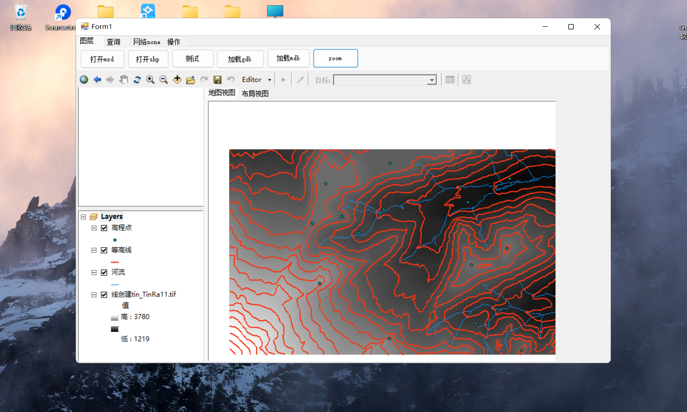
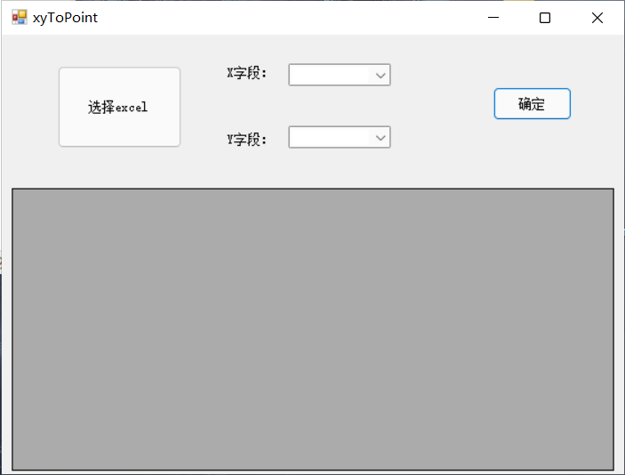
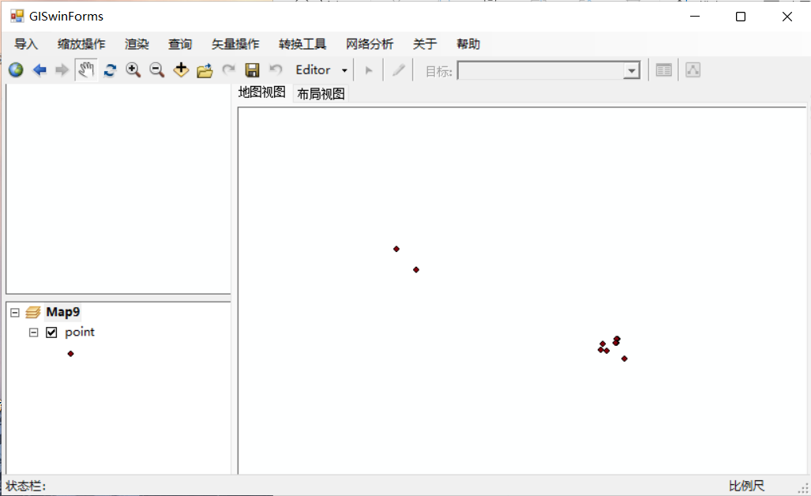
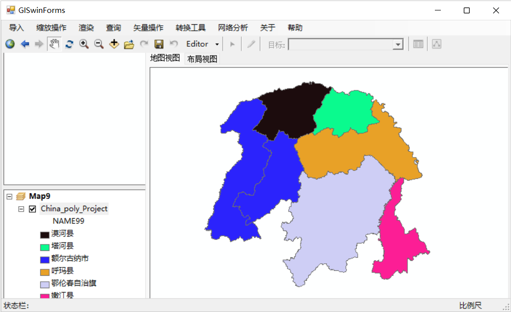

# my GisWinform repo

> 我的AE开发项目，课程记录。
>
> 基于arcgisengine10.2+VS2017+.netframework4.6.1
>
> AE开发是一门过时的技术，现在主流的是webgis
>
> 主要是基本业务逻辑和界面美化比较麻烦，涉及算法问题较少，版本限定已关闭，可以直接使用编译好的版本查看demo

## 资料说明

- DATA为测试数据（包含shp，raster，.gdb，.mdb）。
- 编译好的文件在bin目录，可以直接运行
- 未完待续。。。。。。

## 未完待续

- [x] 打开mxd，shp，gdb，mdb
- [x] 查询
  - [x] 属性查询
  - [x] 空间查询
- [x] 放大，缩小，zoom out
- [ ] 符号化
  - [ ] 点线面符号化
- [ ] 鹰眼
- [ ] 路径规划
- [ ] 矢量操作
  - [ ] 剪切
  - [ ] 融合
- [ ] 添加新工具
- [ ] 冷热区分析

### EXCEL转点

|  |  |
| ------------------------------------------------------------ | ---------------------------------------------------- |

### 渲染

  
