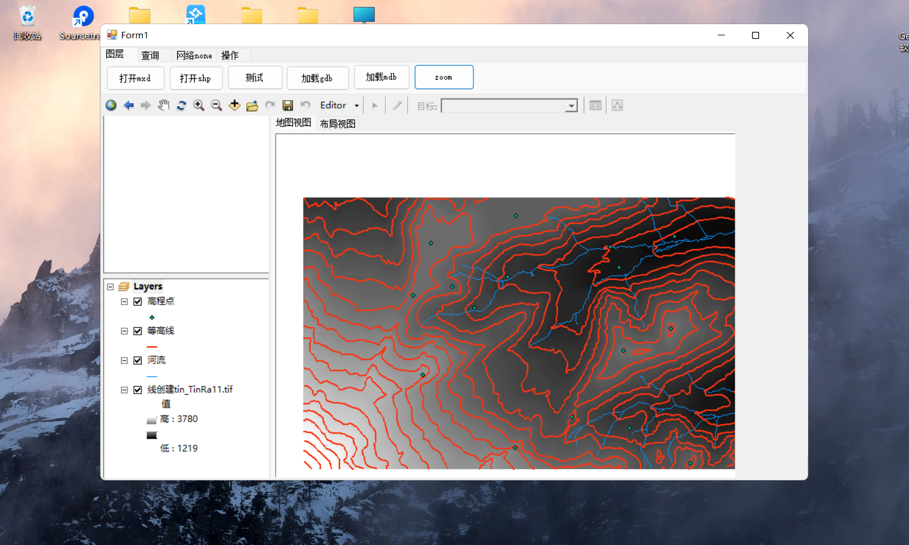

# my GisWinform repo

> 我的AE开发项目，课程记录。
>
> 基于arcgisengine10.2+VS2017+.netframework4.5
>
> AE开发主要是基本业务逻辑和界面美化比较麻烦，涉及算法问题较少，版本限定已关闭

## 资料说明

- DATA为测试数据。
- 未完待续。。。。。。

## 未完待续

- [x] 打开mxd，shp，gdb，mdb
- [x] 查询
  - [x] 属性查询
  - [x] 空间查询
- [x] 放大，缩小，zoom out
- [ ] 鹰眼
- [ ] 路径规划
- [ ] 添加新工具
- [ ] 冷热区分析